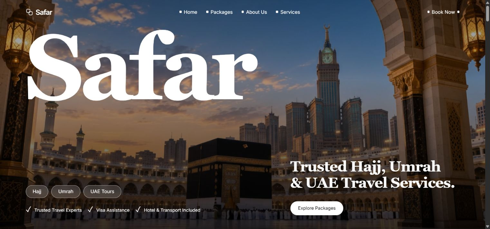

# Safar — Your Sacred Journey

A responsive travel landing page for Hajj, Umrah and UAE journeys, built with HTML, CSS and vanilla JavaScript.

**Live site:** https://safar-waiz.vercel.app



## Features

- Cinematic Makkah video hero with locally stored media
- Travel packages, services and a guided journey timeline
- Destination gallery, pilgrim stories and an accessible FAQ accordion
- Responsive mobile navigation and reduced-motion support
- Validated booking enquiry dialog that prepares an email draft
- Dependency-free static build and Vercel deployment configuration

## Local development

```sh
python -m http.server 5300 --bind 127.0.0.1
```

Open **http://localhost:5300**. No package installation is required for local development.

## Build and validation

Requires Node.js 22 or newer.

```sh
npm run check
npm run build
```

The build verifies HTML asset references and copies the website files into `public/`. Generated output and local Vercel credentials are excluded from Git.

## Project structure

```text
├── assets/             # Photography, portraits and hero video
├── scripts/build.mjs   # Static production build
├── index.html          # Page structure and enquiry dialog
├── styles.css          # Responsive layout and animations
├── app.js              # Content data and interactions
├── preview.png         # Desktop preview
└── vercel.json         # Deployment settings and response headers
```

Update packages, services, destinations, testimonials and FAQs in `app.js`. Edit the hero, navigation, footer and form in `index.html`, and the visual theme in `styles.css`.

## Deployment

The Vercel project is named `safar`. The included configuration uses `npm run build` and serves `public/`. To release an update from this directory, run `vercel --prod --yes`. GitHub's `main` branch contains the source code; connecting automatic Git deployments requires access for the Vercel GitHub integration.

## Enquiry behavior

The form creates an email draft; it does not submit bookings, charge payments or store customer information on a server. Branding, prices, testimonials and `hello@safartravel.com` are reference/demo content. Replace them with verified business details when adapting this template to a real travel business.

## Design and media credits

Recreated from the [Safar template preview on Jiro](https://jiro.build/templates/agency/halal-travel-business-agency-landing-page-safar). Reference photography and video were provided by that public preview at `cdn.jiro.build/Hajj` and remain the property of their respective owners. No ownership or redistribution license for third-party media is asserted by this repository.

Maintained by [Muhammad Waiz Imran](https://github.com/MuhammadWaizImran).
